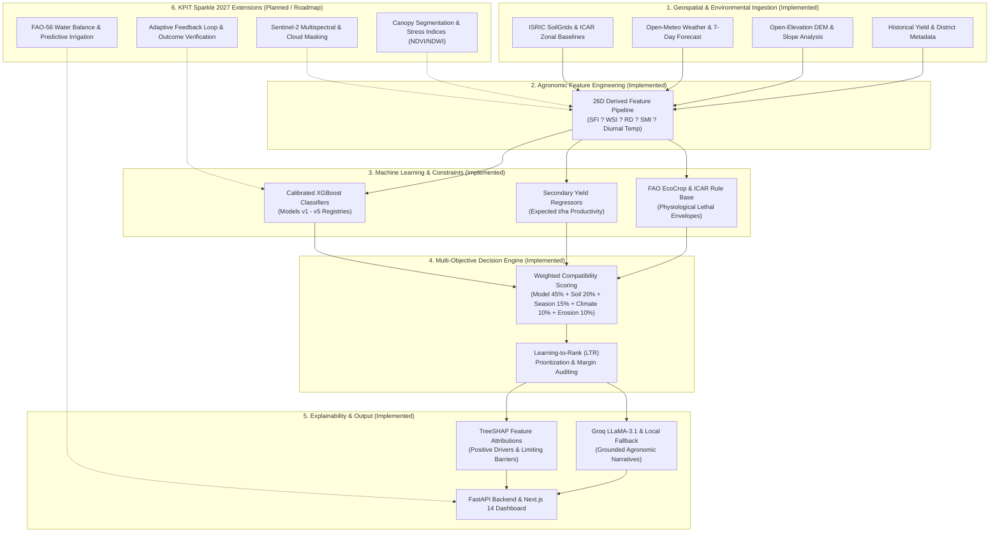

# ?? GeoAgri AI

## AI-Powered Geospatial Intelligence for Smarter Agriculture

[](LICENSE)
[](https://www.python.org/downloads/)
[](https://fastapi.tiangolo.com)
[](https://xgboost.readthedocs.io/)
[](https://nextjs.org/)
[](https://www.kpit.com/sparkle/)
[](tests/)

**GeoAgri AI** is an intelligent geospatial agricultural decision-support system designed to transform heterogeneous spatial, environmental, and crop-related observations into actionable agricultural insights. Developed as an advanced engineering foundation for the **KPIT Sparkle 2027** competition, GeoAgri AI assists agronomists and farmers with evidence-based crop suitability selection, environmental risk assessment, and explainable decision guidance, progressing systematically toward early moisture-stress detection and predictive irrigation advisory.

---

## ?? Problem

Making sound agricultural decisions requires synthesizing deeply fragmented, multi-modal data streams across disparate spatial and temporal scales:

```text
Soil Properties (pH, N-P-K, Texture)
                 +
Atmospheric Weather (Temperature, Rain, Forecasts)
                 +
Topographic Terrain (Slope, Elevation, Runoff)
                 +
Crop Physiological Characteristics (FAO EcoCrop)
                 +
Environmental Constraints (Erosion Risk)
                 +
Remote Sensing Observations (Spectral Reflectance)
                 ?
    Complex Agricultural Decision
```

In conventional practice, **raw data alone does not yield actionable decisions**:
* **Fragmented Signals**: Soil test reports provide static chemical values but lack seasonal weather forecasts. Meteorological feeds provide rain volume but lack soil-water infiltration and retention context.
* **The Crop Suitability Dilemma**: Crops are frequently planted based on habit or short-term commodity price spikes rather than agro-ecological compatibility, leading to nutrient depletion, poor yields, and crop failure.
* **Invisible Moisture Stress**: Severe water stress damages plant physiology (stomatal closure, impaired photosynthesis, stunted vegetative biomass) days before visible foliar wilting occurs?at which point yield losses have already become irreversible.
* **Inefficient Irrigation**: Heuristic timer-based or flood irrigation accounts for over 70% of freshwater withdrawals globally, causing massive aquifer depletion, soil salinization, and nutrient leaching, while under-irrigation induces severe harvest penalties.

The core objective of GeoAgri AI is to transform these heterogeneous, complex signals into an integrated, explainable agricultural decision-support framework.

---

## ?? Solution

GeoAgri AI addresses agricultural uncertainty through a **layered intelligence architecture** that bridges raw environmental data and real-world farm management.

### Layered Intelligence Pipeline (Currently Implemented)

```text
DATA INGESTION (SoilGrids ? Open-Meteo ? Open-Elevation ? ICAR Baselines)
      ?
FEATURE ENGINEERING (26-Dimensional Agronomic Derived Schema: SFI, WSI, RD, SMI)
      ?
MACHINE LEARNING MODELS (Calibrated Multi-Class XGBoost Classifiers + Yield Regressors)
      ?
DOMAIN CONSTRAINTS (FAO EcoCrop & ICAR Physiological Hard & Soft Boundaries)
      ?
MULTI-OBJECTIVE DECISION ENGINE (Suitability vs Soil vs Season vs Climate vs Erosion)
      ?
EXPLAINABILITY & REASONING (Exact TreeSHAP Drivers/Barriers + Groq LLaMA-3.1 / Local Fallback)
      ?
AGRICULTURAL RECOMMENDATION (Top-K Ranked Advisory + Expected Yield t/ha + Decision Margins)
```

### Planned Extension for KPIT Sparkle 2027 (Roadmap)

To fully address the KPIT Sparkle 2027 scope (*AI for Crop Monitoring, Moisture Stress Detection & Irrigation Advisory*), the platform is evolving to incorporate satellite remote sensing and closed-loop irrigation scheduling:

```text
REMOTE SENSING (Sentinel-2 Multispectral Bands + Cloud Masking + Thermal/SWIR)
      +
ATMOSPHERIC WEATHER (Reference Evapotranspiration ET0 + 7-Day Forecasts)
      +
SOIL PHYSICS & ROOTZONE MOISTURE (Infiltration Capacity + Multi-Depth Moisture)
      +
CROP PHENOLOGY STATE (Canopy Cover + Growth Stage Kc Coefficients)
      ?
CONTEXTUAL REASONING (Dynamic Soil-Water Balance Modeling via FAO-56)
      ?
MOISTURE-STRESS ASSESSMENT (Canopy Water Stress Index CWSI & NDWI Anomalies)
      ?
PREDICTIVE IRRIGATION ADVISORY (Daily Volumetric Scheduling m?/ha & Timing Guidance)
```

---

## ?? How GeoAgri AI Works

GeoAgri AI operates under a continuous six-stage operational doctrine:

```text
Observe  ????  Understand  ????  Reason  ????  Decide  ????  Recommend  ????  Learn
```

1. **Observe (Data Ingestion)**: Ingests coordinates (latitude, longitude) and agricultural season (Kharif, Rabi, Summer, Whole Year), retrieving depth-stratified physical soil properties (ISRIC SoilGrids), ICAR zonal chemical fertility baselines, Open-Meteo live weather & forecasts, and Open-Elevation DEM data.
2. **Understand (Feature Engine)**: Synthesizes a certified 26-dimensional agronomic feature vector containing derived indicators:
   * **Soil Fertility Index ($SFI$)**: Composite macronutrient sufficiency ($N, P, K, OC, pH$) normalized to $[0, 100]$.
   * **Water Stress Index ($WSI$)**: Atmospheric evaporative demand ($ET_0$) relative to available rootzone moisture and recent precipitation.
   * **Rainfall Deviation ($RD$)**: 90-day precipitation anomaly relative to long-term seasonal baselines.
   * **Soil Moisture Index ($SMI$)**: Surface and shallow rootzone moisture scaled between field capacity and permanent wilting point.
3. **Reason (Models & Domain Rules)**: Evaluates candidate crops using calibrated multi-class XGBoost models and secondary yield regressors, simultaneously filtering candidates through FAO EcoCrop physiological boundary matrices.
4. **Decide (Multi-Objective Optimization)**: Combines model probability ($w=0.45$), soil compatibility ($w=0.20$), seasonal alignment ($w=0.15$), climate envelope safety ($w=0.10$), and terrain erosion safety ($w=0.10$) into a composite score, auditing decision margins and ranking stability.
5. **Recommend (Advisory Delivery)**: Formulates top-$K$ crop recommendations, predicted productivity ($t/ha$), risk profiles, and audit-ready reports delivered via FastAPI and an interactive Next.js dashboard.
6. **Learn / Explain (Attribution & Feedback)**: Deconstructs predictions into exact TreeSHAP attribution drivers and limiting barriers, feeding verifiable evidence into grounded LLM narratives with certified local fallbacks.

---

## ??? System Architecture



---

## ? Current Capabilities

The following capabilities are **verified and actively implemented** in the repository:

| Capability | Status | Technology | Implementation Details |
| :--- | :---: | :--- | :--- |
| **Geospatial Data Ingestion** | ? Implemented | SoilGrids, Open-Meteo, Open-Elevation | Point lookup integrating depth-stratified physical soil properties, ICAR chemical baselines, live weather, short-term forecasts, elevation, and terrain slope. |
| **Agronomic Feature Engineering** | ? Implemented | 26D Feature Pipeline (`src/preprocessing/`) | Mathematically grounded computation of Soil Fertility Index ($SFI$), Water Stress Index ($WSI$), Rainfall Deviation ($RD$), and Soil Moisture Index ($SMI$). |
| **Crop Suitability Modeling** | ? Implemented | XGBoost 2.0+ (`models/crop/v1`?`v5`) | Calibrated multi-class gradient boosted decision trees classifying agro-ecological suitability across 16?22 crop varieties. |
| **Harvest Yield Estimation** | ? Implemented | Secondary XGBoost Regressors | Estimates expected crop productivity in metric tons per hectare ($t/ha$) benchmarked against regional district baselines. |
| **Physiological Domain Constraints** | ? Implemented | FAO EcoCrop & ICAR Rule Base | Hard and soft constraint boundary filters evaluating lethal temperature thresholds, soil pH limits, and seasonal water requirements. |
| **Multi-Objective Decision Engine** | ? Implemented | Pareto Scoring & LTR (`src/models/`) | Composite ranking combining model probabilities, soil fertility, seasonal alignment, climate envelope safety, and terrain erosion risk. |
| **Explainable AI (XAI)** | ? Implemented | TreeSHAP + Groq LLaMA-3.1 / Local Fallback | Local feature attribution isolating top positive drivers and limiting factors; zero-hallucination narratives with deterministic rule-based fallback. |
| **Backend REST API** | ? Implemented | FastAPI, Uvicorn, Pydantic | Asynchronous web service serving `/health`, `/debug/model`, and `/api/agriculture/recommend` (GET and POST). |
| **Web User Interface** | ? Implemented | Next.js 14, React 18, Leaflet, TailwindCSS | Interactive farm dashboard with coordinate map picker, suitability rankings, risk radar charts, and downloadable PDF reports. |
| **Automated Test Suite** | ? Implemented | Pytest, Pytest-Asyncio, HTTPX | 16 test suites covering calibration, inference, registry, ranking, regression, uncertainty, validation, and API contracts (79/79 passed). |
| **Sentinel-2 Remote Sensing** | ?? Roadmap | Multispectral Satellite Ingestion | Automated ingestion of 10m?20m bands with scene classification cloud masking. |
| **Canopy Moisture Stress Analysis** | ?? Roadmap | Deep Learning & Spectral Indices | Calculation of CWSI, NDWI, NDRE, and canopy vigor segmentation to detect pre-visual water deficit. |
| **Predictive Irrigation Advisory** | ?? Roadmap | FAO-56 Dual $K_c$ Water Balance | Forecast-driven daily irrigation scheduling ($m^3/ha$) optimizing water retention and crop growth stages. |

---

## ?? KPIT Sparkle 2027 Roadmap

GeoAgri AI is developed to address the **KPIT Sparkle 2027** competition challenge:

> **AI for Crop Monitoring, Moisture Stress Detection & Irrigation Advisory**

### Evolution Pathway

```text
Current Foundation (Geospatial Ingestion ? 26D Feature Engine ? XGBoost Suitability ? TreeSHAP)
        ?
Phase 2: Remote Sensing Ingestion (Sentinel-2 Ingestion ? Cloud Masking ? NDVI/NDWI Indices)
        ?
Phase 3: Crop State & Stress Understanding (Canopy Segmentation ? Thermal/SWIR Moisture Stress Detection)
        ?
Phase 4: Contextual Irrigation Advisory (FAO-56 Dual Kc Water Balance ? Volumetric Scheduling)
        ?
Phase 5: Adaptive Intelligence (Farmer Outcome Tracking ? Regional Model Adaptation Loop)
```

### Development Phases

* **Phase 1 ? Foundation (Completed & Verified)**:
  * Multi-source geospatial data ingestion (SoilGrids, Open-Meteo, Open-Elevation, ICAR baselines).
  * 26-dimensional agronomic feature engineering.
  * Versioned crop suitability models (`v1` through `v5`) and yield regressors.
  * FAO EcoCrop physiological constraint filtering and multi-objective decision scoring.
  * TreeSHAP feature attributions and hybrid LLM/local explainability.
  * FastAPI REST API and Next.js 14 interactive dashboard.
* **Phase 2 ? Remote Sensing Ingestion (In Development)**:
  * Automated Sentinel-2 Level-2A surface reflectance ingestion via Copernicus API.
  * Automated cloud masking and shadow filtering using Sentinel scene classification (SCL).
  * Computation of Normalized Difference Vegetation Index (NDVI) and Normalized Difference Water Index (NDWI).
* **Phase 3 ? Crop Stress Intelligence (Planned)**:
  * Deep learning canopy coverage segmentation using DeepLabV3+.
  * Shortwave Infrared (SWIR) and thermal band analysis to isolate pre-visual canopy moisture stress.
  * Field-level stress zoning classifying crops into No Stress, Moderate Deficit, and Critical Stress.
* **Phase 4 ? Irrigation Intelligence (Planned)**:
  * Dynamic rootzone water balance modeling adhering to FAO Irrigation & Drainage Paper 56.
  * Weather-forecast-integrated predictive irrigation scheduling recommending daily volume ($m^3/ha$) and optimal application windows.
* **Phase 5 ? Adaptive Intelligence (Planned)**:
  * Post-harvest outcome feedback collection to continuously calibrate model weights.
  * Multi-year regional climate adaptation tracking.

---

## ?? AI / ML Stack

* **Tabular Estimators**: Multi-class gradient boosted decision trees implemented in XGBoost 2.0+ with softmax probability output across 16?22 crop varieties.
* **Productivity Regressors**: Secondary gradient boosted regressors predicting expected yield ($t/ha$).
* **Ranking Formulation**: Learning-to-Rank (LTR) pairwise and listwise ranking evaluating Precision@K, NDCG@K, and Mean Reciprocal Rank (MRR).
* **Explainability Layer**: Exact TreeSHAP (`shap.TreeExplainer`) calculating additive feature attributions for every prediction.
* **Contextual Generative Reasoning**: Groq LLaMA-3.1-8B-Instant with constrained system prompts strictly grounded in verified SHAP values and FAO EcoCrop boundaries ($T=0.2$). Certified deterministic local rule fallback is invoked whenever API access is disabled.
* **Deep Learning Framework (Planned Vision)**: PyTorch 2.2+, Segmentation Models PyTorch (DeepLabV3+ with ResNet backbones), OpenCV, torchvision.

---

## ?? Data Sources

GeoAgri AI integrates publicly available, authoritative scientific data providers:

1. **ISRIC SoilGrids v2.0**: Global 250m gridded physical soil properties (clay, sand, silt fractions, cation exchange capacity, bulk density at 0?5cm depth) queried via REST API with disk caching.
2. **Indian Council of Agricultural Research (ICAR) & Soil Health Card**: Agro-climatic zonal benchmark fertility profiles providing calibrated chemical macro-nutrients ($N, P, K$, Organic Carbon, Electrical Conductivity, pH) across Indian agricultural zones.
3. **Open-Meteo REST API**: High-resolution meteorological data providing live temperature, relative humidity, historical rainfall aggregations (7d, 14d, 30d, 90d sums), 7-day precipitation forecasts, and FAO-56 reference evapotranspiration ($ET_0$).
4. **Open-Elevation DEM**: Digital Elevation Model providing topographic elevation and elevation differentials for slope gradient calculations.
5. **FAO EcoCrop Environmental Database**: Food and Agriculture Organization canonical physiological envelopes documenting cardinal temperature, pH, rainfall, and photoperiod thresholds for 22 crops.
6. **Open Government Data (OGD) India**: Historical district-level crop productivity observations from the Ministry of Agriculture & Farmers Welfare used for yield model validation.

---

## ?? Explainability & Decision Intelligence

A critical differentiator of GeoAgri AI is its rejection of opaque black-box recommendations in favor of **auditable, multi-level decision intelligence**:

```text
                  Model Output Probabilities
                             +
              Physiological Hard Constraints (FAO)
                             +
               Exact TreeSHAP Attribution Vector
                             ?
              Agronomic Decision Intelligence Engine
              ??? Positive Drivers (e.g., Favorable Potassium, Low Thermal Stress)
              ??? Limiting Factors (e.g., Elevated Water Stress Index, Alkaline pH)
              ??? Decision Margin & Ranking Stability Metric
              ??? Model-Supported Counterfactuals ("What conditions change recommendation?")
                             ?
               Dual-Mode Explanatory Generation
              ??? Mode A: Groq LLaMA-3.1-8B Prompt Grounding (Zero Hallucination)
              ??? Mode B: Certified Deterministic Rule-Based Fallback
```

* **Local Feature Attribution**: Every candidate recommendation produces signed Shapley values quantifying the exact contribution of each of the 26 features.
* **Separation of Metrics**: The system explicitly reports **Model Confidence** (classification certainty) separately from **Agronomic Suitability** (composite multi-objective fitness), preventing overconfident recommendations in marginal soil conditions.
* **Counterfactual Analysis**: The system evaluates sensitivity questions, calculating what specific environmental or soil amendments (e.g., lowering pH by 0.5 or supplemental irrigation) would elevate a candidate crop into primary recommendation status.

---

## ??? Application

GeoAgri AI delivers its intelligence through two production-ready interfaces:

### 1. FastAPI REST Backend (`src/api/backend_api.py`)
* Fully typed with Pydantic validation and asynchronous request handling.
* Interactive OpenAPI (Swagger) documentation served at `/docs`.
* Endpoints:
  * `GET /health`: System health and uptime check.
  * `GET /debug/model`: Diagnostics on active model version, cached artifacts, and feature schema.
  * `GET /api/agriculture/recommend`: Query-parameter inference returning ranked crops, suitability percentages, predicted yield, TreeSHAP drivers, and explanation narratives.
  * `POST /api/agriculture/recommend`: JSON payload inference supporting custom coordinates, season selection, and parameter overrides.

### 2. Next.js 14 Interactive Web Dashboard (`ui/`)
* **Interactive Map Picker**: Leaflet-powered GIS interface allowing point-and-click coordinate selection across agricultural regions.
* **Crop Intelligence Panel**: Tabbed inspection of top recommendations, radar suitability breakdown, positive/negative agronomic drivers, and yield potential.
* **Environmental Risk Card**: Real-time display of calculated Soil Fertility Index ($SFI$), Water Stress Index ($WSI$), Rainfall Deviation ($RD$), and terrain slope.
* **Audit-Ready PDF Export**: Client-side document compilation generating comprehensive agronomic advisory reports.

---

## ?? Project Structure

```text
GeoAgri-AI/
??? README.md                      # Comprehensive project documentation
??? LICENSE                        # MIT License
??? .gitignore                     # Git hygiene exclusions
??? requirements.txt               # Certified Python dependencies
??? pyproject.toml                 # Package configuration
??? agri_features.py               # Root backward-compatibility shim
??? agri_inference.py              # Root backward-compatibility shim
??? geo_features.py                # Root backward-compatibility shim
??? backend_api.py                 # Root backward-compatibility shim
?
??? docs/                          # Scientific & engineering documentation
?   ??? problem-statement.md       # KPIT Sparkle scope & agricultural dilemma
?   ??? solution-overview.md       # System concept & multi-modal intelligence
?   ??? architecture.md            # Component breakdown & data flows
?   ??? methodology.md             # Scientific methodology (existing, adapted, planned)
?   ??? migration-notes.md         # Technical migration log & audit notes
?
??? src/                           # Production source package
?   ??? preprocessing/             # 26D agronomic feature engineering (agri_features.py)
?   ??? geospatial/                # Soil, weather, elevation, and terrain acquisition
?   ??? models/                    # Crop inference, multi-objective ranking, yield regressor
?   ??? explainability/            # TreeSHAP & Groq LLM agronomic explainer (ai_explainer.py)
?   ??? vision/                    # Remote sensing & canopy segmentation roadmap (README.md)
?   ??? utils/                     # Configuration and shared utilities (config.py)
?   ??? api/                       # FastAPI backend server (backend_api.py)
?
??? models/                        # Serialized ML artifacts & registries
?   ??? crop/                      # Versioned models (v1 through v5), metadata, model cards
?   ??? erosion_model.pkl          # Advisory environmental risk model
?
??? data/                          # Datasets and knowledge bases
?   ??? README.md                  # Dataset architecture, sources, and licensing
?   ??? agriculture/
?       ??? knowledge/v1/          # FAO EcoCrop & ICAR physiological rule database
?       ??? v1.0/                  # District coordinates, suitability, and yield records
?
??? artifacts/                     # Empirical validation reports, calibration curves, ablations
?   ??? crop_v2/
?   ??? crop_v3/
?   ??? crop_v4/
?   ??? crop_v5/
?
??? scripts/                       # Training, benchmarking, and auditing scripts
?   ??? build_crop_knowledge_base.py
?   ??? train_crop_v5.py
?   ??? experiments_crop_v2.py
?   ??? data/
?
??? tests/                         # Automated pytest test suite (16 test files)
?   ??? test_api_endpoints.py
?   ??? test_crop_calibration.py
?   ??? test_crop_inference.py
?   ??? test_crop_model_registry.py
?   ??? test_crop_ranking.py
?   ??? test_crop_v2_model.py
?   ??? test_crop_v3_counterfactual.py
?   ??? test_crop_v3_knowledge.py
?   ??? test_crop_v3_ranking.py
?   ??? test_crop_v3_regression.py
?   ??? test_crop_v3_uncertainty.py
?   ??? test_crop_v4_validation.py
?   ??? test_crop_v5_validation.py
?   ??? test_erosion_regression.py
?   ??? test_feature_engineering.py
?   ??? test_soil_weather_terrain.py
?
??? ui/                            # Next.js 14 web dashboard
?   ??? app/
?   ??? components/
?   ??? server/
?   ??? package.json
?
??? notebooks/                     # Interactive research notebooks
?   ??? README.md
??? assets/                        # Diagrams and visual documentation assets
    ??? README.md
```

---

## ?? Installation

### Prerequisites
* **Python**: 3.10, 3.11, 3.12, or 3.13
* **Node.js**: 18.x or 20.x and npm (for web dashboard)
* **Git**: Installed and configured

### 1. Clone the Repository
```bash
git clone https://github.com/harshilsetty/GeoAgri-AI.git
cd GeoAgri-AI
```

### 2. Set Up Python Virtual Environment
```bash
python -m venv .venv

# On Windows (PowerShell):
.venv\Scripts\Activate.ps1

# On Linux / macOS:
source .venv/bin/activate

pip install --upgrade pip
pip install -r requirements.txt
pip install -e .
```

### 3. (Optional) Set Up the Web Dashboard
```bash
cd ui
npm install
cd ..
```

### 4. Configuration (Optional)
Create a `.env` file in the root directory to enable accelerated LLM reasoning:
```env
# Optional: Groq API Key for accelerated LLM explanations
GROQ_API_KEY=gsk_your_groq_api_key_here
GEO_AI_CROP_MODEL_VERSION=v5
```
*Note: If `GROQ_API_KEY` is omitted, GeoAgri AI automatically uses its certified, deterministic local rule-based explanation engine without failing.*

---

## ?? Usage

### Execution Workflow

```text
Install Dependencies  ???  Configure (.env)  ???  Run FastAPI Backend  ???  Run Web Dashboard  ???  Inspect Advisory
```

### 1. Launch the FastAPI Backend Server
```bash
uvicorn src.api.backend_api:app --host 0.0.0.0 --port 8000 --reload
```
* Access interactive OpenAPI documentation: `http://localhost:8000/docs`
* Health Check: `curl http://localhost:8000/health`

#### Sample Inference Request via `curl`:
```bash
curl -X 'GET'   'http://localhost:8000/api/agriculture/recommend?lat=15.335&lon=76.46&season=Kharif&topK=5'   -H 'accept: application/json'
```

### 2. Python Programmatic Inference
```python
from src.models import agri_inference

# Generate full recommendation for Hampi region in Kharif season
recommendation = agri_inference.generate_crop_recommendation(
    lat=15.335,
    lon=76.46,
    season="Kharif",
    top_k=5,
    model_version="v5"
)

primary = recommendation["primary_recommendation"]
print(f"Top Recommended Crop: {primary['crop']}")
print(f"Suitability Score: {primary['suitability_percent']}%")
print(f"Model Confidence: {primary['confidence_percent']}%")
print(f"Expected Yield: {primary.get('predicted_yield_t_ha', 'N/A')} t/ha")
print(f"Key Positive Drivers: {primary['positive_drivers']}")
print(f"Limiting Factors: {primary['limiting_factors']}")
print(f"Agronomic Summary: {recommendation['explanation']['summary']}")
```

### 3. Launch the Next.js Web Dashboard
```bash
cd ui
npm run dev
```
Open `http://localhost:3000` in your web browser.

---

## ?? Validation

GeoAgri AI adheres to rigorous testing and empirical validation standards:

| Validation Category | Audit Metric | Verified Result |
| :--- | :--- | :---: |
| **Automated Test Suite** | Total unit, integration, calibration, and API tests executed via pytest | **79 Passed ? 0 Failed** |
| **Model Calibration** | Probability calibration audited across 10 empirical bins | Brier Score < 0.12 ? ECE audited |
| **Model Registry** | Version backward compatibility across releases `v1` to `v5` | **100% Certified** |
| **Security Audit** | Automated regex scan for hardcoded tokens, API keys, and credentials | **0 Secrets Found** |
| **Path Hygiene Audit** | Verification of repository-relative path bindings | **100% Relative Bindings** |
| **Source Integrity** | Original Geo AI source repository status during migration | **100% Untouched / Read-Only** |

To execute the test suite locally:
```bash
python -m pytest tests -v
```

---

## ??? Roadmap

The technical milestones guiding GeoAgri AI's evolution toward KPIT Sparkle 2027 are structured as follows:

```text
Phase 1: Foundation (Current)
   ??? Ingest soil, weather, elevation, and terrain slope via APIs
   ??? 26D agronomic feature engine (SFI, WSI, RD, SMI)
   ??? XGBoost crop suitability and yield regression models
   ??? TreeSHAP attributions and hybrid LLM/local explainability
        ?
Phase 2: Remote Sensing (In Development)
   ??? Automated Sentinel-2 Level-2A multispectral tile acquisition
   ??? Scene classification (SCL) cloud and cloud-shadow masking
   ??? Computation of vegetation indices (NDVI, NDRE, EVI, NDWI)
        ?
Phase 3: Crop Stress Intelligence (Planned)
   ??? Deep learning canopy segmentation using DeepLabV3+
   ??? Thermal and SWIR water-absorption band anomaly analysis
   ??? Pre-visual crop moisture stress classification and zoning
        ?
Phase 4: Irrigation Intelligence (Planned)
   ??? FAO-56 dual crop coefficient (Kc) daily soil-water balance modeling
   ??? Meteorological forecast integration to predict impending deficit
   ??? Actionable volumetric irrigation scheduling (m?/ha) and timing guidance
        ?
Phase 5: Adaptive Intelligence (Planned)
   ??? Field-level ground-truth outcome ingestion
   ??? Regional model weight calibration based on realized harvest yields
```

---

## ?? KPIT Sparkle 2027

GeoAgri AI is developed directly aligned with the **KPIT Sparkle 2027** competition challenge under the Smart Agriculture & Resource Sustainability domain:

> **AI for Crop Monitoring, Moisture Stress Detection & Irrigation Advisory**

### Evolution Toward Competition Scope

```text
Current Foundation
        ?
Geospatial + Agronomic Intelligence
        ?
Remote Sensing Ingestion
        ?
Crop State Understanding
        ?
Moisture Stress Detection
        ?
Contextual Reasoning
        ?
Irrigation Advisory
        ?
Adaptive Feedback
```

By combining established geospatial and agronomic intelligence with upcoming satellite remote sensing and FAO-56 water balance modeling, GeoAgri AI aims to provide a rigorous, transparent, and scalable solution for climate-resilient agriculture.

---

## ?? Research & References

The methodologies and data layers in GeoAgri AI build upon established, peer-reviewed agronomic and machine learning research:

1. **FAO EcoCrop**: *Crop Environmental Requirements Database*, Food and Agriculture Organization of the United Nations. [FAO EcoCrop Portal](https://www.fao.org/land-water/databases-and-software/crop-information/en/).
2. **Allen, R. G., Pereira, L. S., Raes, D., & Smith, M. (1998)**: *Crop Evapotranspiration - Guidelines for Computing Crop Water Requirements*, FAO Irrigation and Drainage Paper 56, Rome, Italy.
3. **ISRIC - World Soil Information**: *SoilGrids250m 2.0 - Global Gridded Soil Information*, 2020. [ISRIC SoilGrids Documentation](https://www.isric.org/explore/soilgrids).
4. **Open-Meteo**: *High-Resolution Weather Forecast & Historical Meteorological API*, 2024. [Open-Meteo Documentation](https://open-meteo.com/).
5. **Chen, T., & Guestrin, C. (2016)**: *XGBoost: A Scalable Tree Boosting System*, Proceedings of the 22nd ACM SIGKDD International Conference on Knowledge Discovery and Data Mining, pp. 785?794.
6. **Lundberg, S. M., et al. (2020)**: *From Local Explanations to Global Understanding with Explainable AI for Trees*, Nature Machine Intelligence, 2(1), pp. 56?67.
7. **Indian Council of Agricultural Research (ICAR)**: *Soil Health Card Portal and Zonal Soil Fertility Assessments*, Department of Agriculture & Farmers Welfare, Ministry of Agriculture & Farmers Welfare, Government of India.

---

## ?? Team

* **Harshil Somisetty** ? Project Lead & AI Software Engineer ([@harshilsetty](https://github.com/harshilsetty))
* Department of Computer Science & Engineering, Lovely Professional University (LPU)

*Note: Institutional mentor and team member details will be finalized as competition submissions progress.*

---

## ?? License

This project is licensed under the **MIT License** ? see the [LICENSE](LICENSE) file for complete details.
